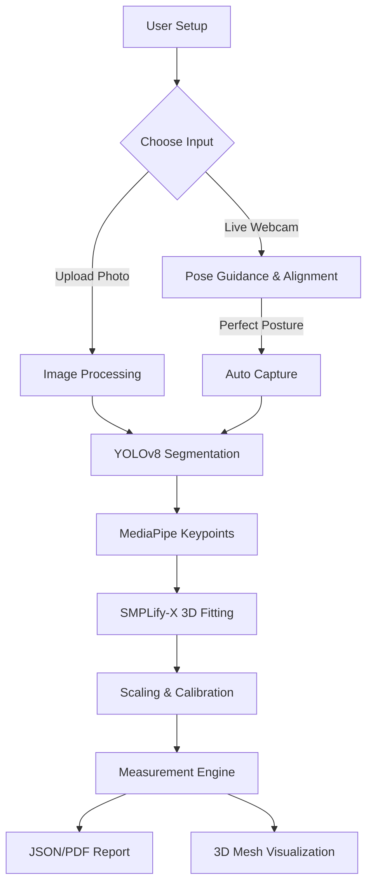

# 🤳 FitLens: Professional AI Body Measurement System

[](https://github.com/fitlens)
[](https://react.dev/)
[](https://pytorch.org/)
[](https://opencv.org/)

FitLens is a professional-grade body measurement suite that leverages cutting-edge computer vision and deep learning to extract precise physical dimensions from standard 2D images. By combining **YOLOv8 segmentation**, **MediaPipe landmark detection**, and **SMPLify-X 3D body estimation**, FitLens achieves sub-centimeter accuracy for tailoring, fitness tracking, and medical posture analysis.

---

## 📖 Project Overview

FitLens provides a dual-model experience:
1.  **🚀 Web Dashboard (Recommended):** A modern React-based interface with a Flask backend, utilizing YOLOv8 and SMPLify-X for 3D reconstruction and circumference measurements.
2.  **🖥️ Desktop Standalone:** A lightweight R-CNN-powered real-time tracking system for posture correction and direct measurements via a live camera feed.

The system doesn't just measure; it **guides**. Users receive real-time feedback on their posture, distance from the camera, and alignment to ensure every capture is photogrammetrically valid.

---

## ✨ Features

- **🎯 High-Precision Measurements:** Captures 15+ body metrics including Height, Shoulder Width, Chest/Waist/Hip Circumferences, and Limb Lengths.
- **🧊 3D Body Reconstruction:** Generates a personalized 3D mesh (SMPL) based on 2D images for accurate volume and circumference extraction.
- **🤖 Intelligent Guidance:** Real-time posture correction ("Stand straight", "Move back", "Straighten arms").
- **🖼️ Automatic Segmentation:** Isolates the person from the background using YOLOv8-seg to eliminate environmental measurement interference.
- **📏 Smart Calibration:** Supports both reference object calibration (e.g., A4 paper) and user-height-based scaling.
- **📄 Professional Reporting:** Generates detailed PDF and Word reports with highlighted keypoints and dimensional data.
- **🔒 Privacy First:** All processing can be done locally; images are processed in-memory and not stored by default.

---

## 🖼️ Screenshots / Demo

| Real-time Guidance | 3D Mesh Reconstruction | Measurement Dashboard |
| :---: | :---: | :---: |
|  |  |  |

---

## 🛠️ Technology Stack

| Layer | Technologies |
| :--- | :--- |
| **Frontend** | React 18, Vite, Three.js (3D Mesh Visualization), Axios, Socket.IO |
| **Backend** | Python 3.10, Flask, Flask-SocketIO |
| **Vision/ML** | YOLOv8 (Ultralytics), MediaPipe, PyTorch, Detectron2 (Desktop Standalone), InsightFace |
| **Core Logic** | OpenCV, NumPy, SciPy, SMPLify-X |
| **Reporting** | ReportLab (PDF), python-docx (Word) |

---

## 🏗️ Project Architecture

### System Flow


---

## 📂 Folder Structure

```text
FitLens-dev2/
├── backend/                # Flask API & CV Logic
│   ├── app.py              # Main Entry Point (YOLO Pipeline)
│   ├── measurement_engine.py# Geometric measurement algorithms
│   ├── landmark_detector.py # MediaPipe & Shoulder refinement
│   └── smpl/               # SMPL model & 3D estimators
├── frontend-vite/          # Modern React + Vite Dashboard
│   ├── src/                # UI Components & 3D mesh views
│   └── package.json        # Frontend Dependencies
├── processing/             # SMPLify-X heavy processing
├── models/                 # Model weights (.pt, .onnx)
├── data/                   # Temporary cache & image inputs
├── main.py                 # Standalone R-CNN Implementation
├── config.py               # Shared application configuration
└── requirements.txt        # Backend dependencies
```

---

## 📋 Prerequisites

- **OS:** Windows 10/11, Ubuntu 20.04+, or macOS (Intel/M1).
- **Python:** 3.8 to 3.11 (Detectron2 has compatibility issues with 3.12).
- **Node.js:** v18 or later (for frontend).
- **Hardware:** 
  - Minimum: 8GB RAM, 4-core CPU.
  - Recommended: 16GB RAM, NVIDIA GPU (8GB+ VRAM) for SMPLify-X.

---

## 🚀 Installation Guide

### Windows
1.  **Clone the Repository:**
    ```bash
    git clone https://github.com/your-repo/fitlens.git
    cd fitlens
    ```
2.  **Environment Setup:**
    ```bash
    python -m venv venv
    .\venv\Scripts\activate
    ```
3.  **Install Backend Core:**
    ```bash
    pip install -r requirements.txt
    cd backend
    pip install -r requirements.txt
    ```
4.  **Frontend Setup:**
    ```bash
    cd ../frontend-vite
    npm install
    ```

### Linux / macOS
```bash
python3 -m venv venv
source venv/bin/activate
pip install -r requirements.txt
cd frontend-vite && npm install
```

---

## ⚙️ Environment Variables (.env)

### Backend (`/backend/.env`)
```env
PORT=5000
DEBUG=True
ALLOWED_ORIGINS=http://localhost:5173
MODEL_CONFIDENCE=0.5
SAVE_OUTPUT=True
```

### Frontend (`/frontend-vite/.env`)
```env
VITE_API_BASE_URL=http://localhost:5000
VITE_SOCKET_URL=http://localhost:5000
```

---

## 🏃 Running the Application

### Option 1: Full-Stack Web App (Recommended)
You can use the provided batch files on Windows:
```bash
# Start everything
RUN_FULLSTACK.bat
```
Or manually:
1.  **Backend:** `cd backend && python app.py`
2.  **Frontend:** `cd frontend-vite && npm run dev`

### Option 2: Standalone R-CNN App
```bash
python main.py
```

---

## 🔌 API Endpoints

### 🩺 Health Check
`GET /api/health`
- **Response:** `{ "status": "healthy", "models_loaded": { ... } }`

### 📤 Process Images
`POST /api/upload/process`
- **Body (JSON):**
    ```json
    {
      "front_image": "base64...",
      "side_image": "base64...",
      "reference_image": "base64...",
      "user_height": 175.0,
      "gender": "male"
    }
    ```
- **Response:** Detailed measurements, 3D mesh data, and calibration info.

---

## 🛡️ Authentication and Authorization
*Note:* The current version uses local execution and does not implement a login system for speed of use during evaluation. Production deployment would require an OAuth2 or JWT-based implementation (planned enhancement).

---

## 📘 Usage Guide

1.  **Calibration:** Stand about 2-3 meters from the camera. If using a reference object (like A4 paper), ensure it is visible in the dedicated calibration photo.
2.  **Posture:** Stand facing the camera with arms slightly away from the body (A-pose).
3.  **Lighting:** Ensure even lighting; avoid strong backlighting or shadows that obscure body edges.
4.  **Capture:** The system will auto-capture when your posture is green-aligned.

---

## 🛠️ Troubleshooting

- **"Detectron2 not found":** This is common on Windows. Use `INSTALL_WINDOWS.md` for specific building instructions or fall back to the YOLOv8/MediaPipe pipeline which has no such constraints.
- **CUDA/GPU Errors:** Ensure NVIDIA drivers are up to date. If no GPU is found, the system defaults to CPU, though SMPLify-X will be significantly slower.
- **Socket Connection Failed:** Check if the backend is running and the CORS bridge is set correctly in `.env`.

---

## 🔮 Future Enhancements
- [ ] Integration with mobile AR (iOS/Android).
- [ ] Automated clothing recommendation engine.
- [ ] Multi-user profiles and measurement history tracking.
- [ ] Cloud-sync with fitness apps (Apple Health, Google Fit).

---

## 🤝 Contributing
Contributions are what make the open source community such an amazing place to learn, inspire, and create. Any contributions you make are **greatly appreciated**.

1. Fork the Project
2. Create your Feature Branch (`git checkout -b feature/AmazingFeature`)
3. Commit your Changes (`git commit -m 'Add some AmazingFeature'`)
4. Push to the Branch (`git push origin feature/AmazingFeature`)
5. Open a Pull Request

---

## 📜 License
Distributed under the MIT License. See `LICENSE` for more information.

---

## 👥 Authors
- **Project Lead:** [Your Name/Org]
- **Developers:** [Member Names]

---

## 🙏 Acknowledgments
- [Ultralytics YOLOv8](https://github.com/ultralytics/ultralytics)
- [MediaPipe by Google](https://google.github.io/mediapipe/)
- [SMPLify-X](https://github.com/vchoutas/smplify-x)
- [Detectron2](https://github.com/facebookresearch/detectron2)

