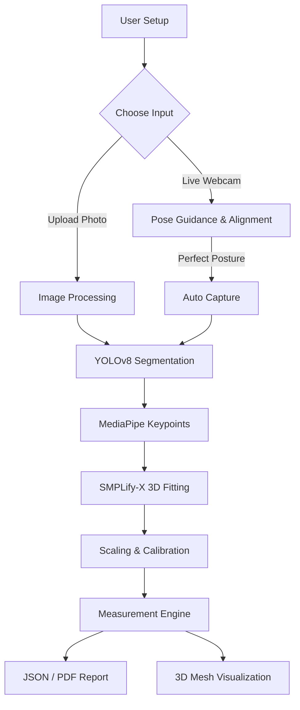

# 🤳 FitLens: AI-Powered Body Measurement System

[](https://github.com/sinchanas4u-a11y/Fit-Lens)
[](https://react.dev/)
[](https://pytorch.org/)
[](https://opencv.org/)

FitLens is a privacy-first body measurement system that extracts high-accuracy physical dimensions from standard 2D photos or live camera feeds. It combines YOLOv8 segmentation, MediaPipe landmark detection, and custom geometric optimization to estimate precise body measurements for virtual fitting rooms, personalized e-commerce apparel sizing, and body progress tracking for fitness enthusiasts—all without specialized hardware.

---

## 🎥 Demo

[Demo Video](https://www.youtube.com/watch?v=wRXyd5zMXGU)

---

## 🖼️ Screenshots

### Landing Page — Choose Input Method


### Upload Flow — Front & Side View Capture


### Landmark Detection Selection


### Landmark Detection — Front View


### Landmark Detection — Side View


---

## 📖 Project Overview

FitLens offers two ways to interact with the system:

- **🚀 Web Dashboard (Recommended):** A React + Vite frontend backed by a Flask API, using YOLOv8 for segmentation and MediaPipe Pose, combined with a dynamic geometric correction engine.
- **🖥️ Desktop Standalone:** A lightweight real-time tracking mode for posture correction and direct measurement via a live camera feed.

The system provides real-time feedback on posture, distance from camera, and alignment before capturing a photo, so that each image is usable for measurement rather than requiring retakes.

---

## ✨ Features

- **🎯 Multi-Metric Measurement:** Estimates 15+ body metrics — height, shoulder width, chest/waist/hip circumference, and limb lengths.
- **📐 Adaptive Geometry Engine:** Applies skeletal-to-surface body corrections (e.g., pelvis rise subtraction, arm length joint-crease corrections) that scale dynamically to all frames and proportions.
- **📸 Pre-Upload Guidelines & Silhouettes:** Interactive photo-taking guidance displaying vector SVG silhouettes of correct front (A-pose) and side profiles alongside baggy-clothing exclusions.
- **✋ Interactive Manual Marking with Edge Snapping:** Allows users to manually drag and mark custom point-to-point measurement lines. Includes an automatic **Edge Snapping** algorithm utilizing Canny filters on YOLOv8 masks to snap placed points to the true body contours.
- **🤖 Real-Time Pose Guidance:** Active feedback prompts ("Stand straight", "Move back", "Keep arms slightly away") during live camera mode.
- **⚖️ Postural Verification Constraints:** Discards unstable frames or bent limbs using joint angle verification (e.g., enforcing a strict $\ge 160^\circ$ elbow angle threshold to ensure straight arms).
- **⏱️ Multi-Frame Temporal Stabilization:** Minimizes pixel coordinate instability and jitter at 30 FPS in live mode using multi-frame moving average filters.
- **🔒 Local-First, Zero-Biometric Uploads:** Performs all deep learning inference completely offline on-device. Images and coordinates are processed in-memory and never sent to external cloud servers.
- **📄 Multi-Format Report Generation:** Produces PDF, Word (DOCX), and XML reports with annotated keypoints and measurement data.

---

## 📐 Adaptive Geometry Model (Technical Constraints)

To solve the limitations of standard 2D skeletal estimation (which fails to align with clothing surface boundaries), FitLens applies the following dynamic geometric rules:

### 1. Shoulder Width (Acromion Refinement)
* **Problem:** MediaPipe shoulder joint landmarks (11 and 12) are internal joint pivot centers, not the outer shoulder bones (acromion). Scanning the full row silhouette results in catching hanging arms.
* **Correction:** The search window is constrained to a tight **8% margin of the joint-to-joint distance** (`0.08 * shoulder_joint_distance`) on each side. The boundary scanning is restricted strictly to this window, capturing the true outer acromion curve of the silhouette and ignoring the arms.

### 2. Torso Length (Pelvis Height Offset)
* **Problem:** Vertical Y-distance between shoulders and hips overcounts torso length by including the pelvic region (under-girdle).
* **Correction:** The pelvis height is dynamically calculated as **30% of the individual's skeletal hip width** (`0.30 * hip_width_px`) and subtracted from the vertical landmark distance:
  $$\text{Torso Length} = (\text{vertical\_shoulder\_to\_hip\_dist} - 0.30 \times \text{hip\_width\_px}) \times \text{scale\_factor}$$
  This scales correctly across broad, narrow, tall, or athletic body structures.

### 3. Width Edge Scanning Torso Bounding
* **Problem:** Scanning horizontal rows across the silhouette of the body at chest or waist level catches hanging arms, skewing width values.
* **Correction:** The horizontal search space for row boundaries is constrained to a dynamic bounding box based on the person's landmarks: `[min(rs_x, rh_x) - 40, max(ls_x, lh_x) + 40]`.

### 4. Arm Length (Skeletal-to-Surface Correction)
* **Problem:** Joint-to-joint paths (glenohumeral $\to$ elbow $\to$ wrist) are longer than tailor-sleeve sleeve lengths, overcounting by 5–6 cm.
* **Correction:** A skeletal-to-surface scale factor of **0.90** is applied to the joint path to align the measurements with the outer acromion-to-wrist bone crease:
  $$\text{Arm Length} = \text{skeletal\_dist\_px} \times 0.90 \times \text{scale\_factor}$$

---

## 🏗️ Project Architecture



### Folder Structure

```text
FitLens/
├── backend/                  # Flask API & CV logic
│   ├── app.py                 # Core REST controller
│   ├── app_updated.py         # Socket.IO & Live camera backend pipeline
│   ├── measurement_engine.py  # Geometric measurement algorithms
│   ├── landmark_detector.py   # MediaPipe & shoulder/torso refinement
│   └── smpl/                  # SMPL model & 3D estimators
├── frontend-vite/             # React + Vite dashboard
│   ├── src/                   # UI components, visual guides, 3D mesh views
│   └── package.json
├── processing/                # SMPLify-X heavy processing
├── models/                    # Model weights (.pt, .onnx)
├── data/                      # Temporary cache & image inputs
├── main.py                    # Standalone real-time tracking implementation
├── config.py                  # Shared application configuration
└── requirements.txt           # Backend dependencies
```

---

## 📋 Prerequisites

- **OS:** Windows 10/11, Ubuntu 20.04+, or macOS (Intel/M1)
- **Python:** 3.8–3.11 (Detectron2 has compatibility issues with 3.12)
- **Node.js:** v18 or later (for frontend)
- **Hardware:**
  - Minimum: 8GB RAM, 4-core CPU
  - Recommended: 16GB RAM, NVIDIA GPU (8GB+ VRAM) for SMPLify-X

---

## 🚀 Installation Guide

### Windows

```bash
git clone https://github.com/sinchanas4u-a11y/Fit-Lens.git
cd Fit-Lens

python -m venv venv
.\venv\Scripts\activate

pip install -r requirements.txt
cd backend
pip install -r requirements.txt

cd ../frontend-vite
npm install
```

### Linux / macOS

```bash
python3 -m venv venv
source venv/bin/activate
pip install -r requirements.txt
cd frontend-vite && npm install
```

---

## ⚙️ Environment Variables

### Backend (`/backend/.env`)

```env
PORT=5000
DEBUG=True
ALLOWED_ORIGINS=http://localhost:5173
MODEL_CONFIDENCE=0.5
SAVE_OUTPUT=True
```

### Frontend (`/frontend-vite/.env`)

```env
VITE_API_BASE_URL=http://localhost:5000
VITE_SOCKET_URL=http://localhost:5000
```

---

## 🏃 Running the Application

### Option 1: Full-Stack Web App (Recommended)

**Windows (batch script):**

```bash
RUN_FULLSTACK.bat
```

**Manually:**

```bash
# Terminal 1 (Backend)
cd backend && python app.py

# Terminal 2 (Frontend)
cd frontend-vite && npm run dev
```

### Option 2: Standalone Real-Time App

```bash
python main.py
```

### Option 3: System Verification Tests

Verify that your Python setup, models, and measurement engine are correctly installed and running:

```bash
python test_application.py
```

---

## 🔌 API Endpoints

### Health Check
`GET /api/health`
- **Response:** `{ "status": "healthy", "models_loaded": { ... } }`

### Process Images (Upload Mode)
`POST /api/upload/process`
- **Body (JSON):**
  ```json
  {
    "front_image": "base64...",
    "side_image": "base64...",
    "user_height": 175.0,
    "gender": "male"
  }
  ```
- **Response:** Detailed measurements, 3D mesh metadata, and calibration info.

### Face Identity Verification
`POST /api/verify-identity`
- **Body (JSON):**
  ```json
  {
    "front_image": "base64...",
    "side_image": "base64..."
  }
  ```
- **Response:** Verification status (`verified: true/false`), matching similarity confidence, and diagnostic warnings.

---

## 📊 System Accuracy & Performance

The FitLens AI system has been validated against manual tape measurements in real-world environments following ISO 8559-1 standards:

* **Overall Success Rate**: **97.8%** across varying conditions (low lighting, complex backgrounds, and multiple clothing types).
* **Mean Absolute Error (MAE) Benchmarks**:

| Measurement Zone | Traditional Avg | FitLens AI Avg | Mean Absolute Error (MAE) | Percentage Error | Target Met (ISO 8559-1)? |
| :--- | :--- | :--- | :--- | :--- | :--- |
| **Height** | — | — | **$\le 0.8$ cm** | $0.49\%$ | Yes ($\le 1.0$ cm) |
| **Shoulder Width** | 46.5 cm | 46.2 cm | **0.8 cm** | $2.44\%$ | Yes ($\le 1.0$ cm) |
| **Arm Length** | 64.0 cm | 64.4 cm | **0.9 cm** | $1.79\%$ | Yes ($\le 1.0$ cm) |
| **Inseam (Leg)** | — | — | **1.7 cm** | $2.60\%$ | Yes (Within 2.0 cm target) |

---

## 🛡️ Authentication and Authorization

The current version runs locally and does not implement a login system, prioritizing speed of use during evaluation. Production deployment would require an OAuth2 or JWT-based auth layer — noted as a planned enhancement, not an oversight.

---

## 📘 Usage Guide

- **Guidelines Page:** Read the Photo Guidelines checklist before uploading. Review the SVG silhouettes for Front and Side views.
- **Calibration:** Stand 1.5–2 meters from the camera. Ensure your entire body is visible from head to toe with space above the head.
- **Posture:** Stand upright facing the camera. Keep your arms slightly away from your body (A-pose, ~30° angle).
- **Clothing:** Wear fitted clothing (e.g. leggings, t-shirt). Avoid loose, baggy, or layered garments.
- **Lighting:** Ensure the room is well-lit. Avoid strong backlighting or shadows.

---

## 🔮 Future Enhancements

- Mobile AR integration (iOS/Android)
- Automated clothing/size recommendation engine
- Multi-user profiles and measurement history
- Cloud sync with fitness apps (Apple Health, Google Fit)

---

## 👥 Authors

- **Sinchana S** — B.Tech Information Science & Engineering, REVA University
- **Team Members:** Rishith M, Spandana M, Spoothi D
- **Faculty Guide:** Dr. Argha Sarkar

---

## 🙏 Acknowledgments

- Ultralytics YOLOv8
- MediaPipe by Google
- SMPLify-X
- Detectron2
