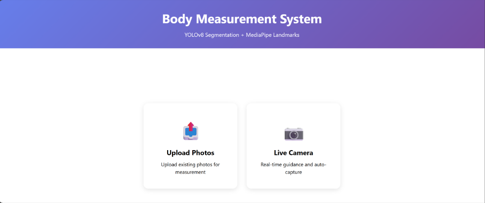
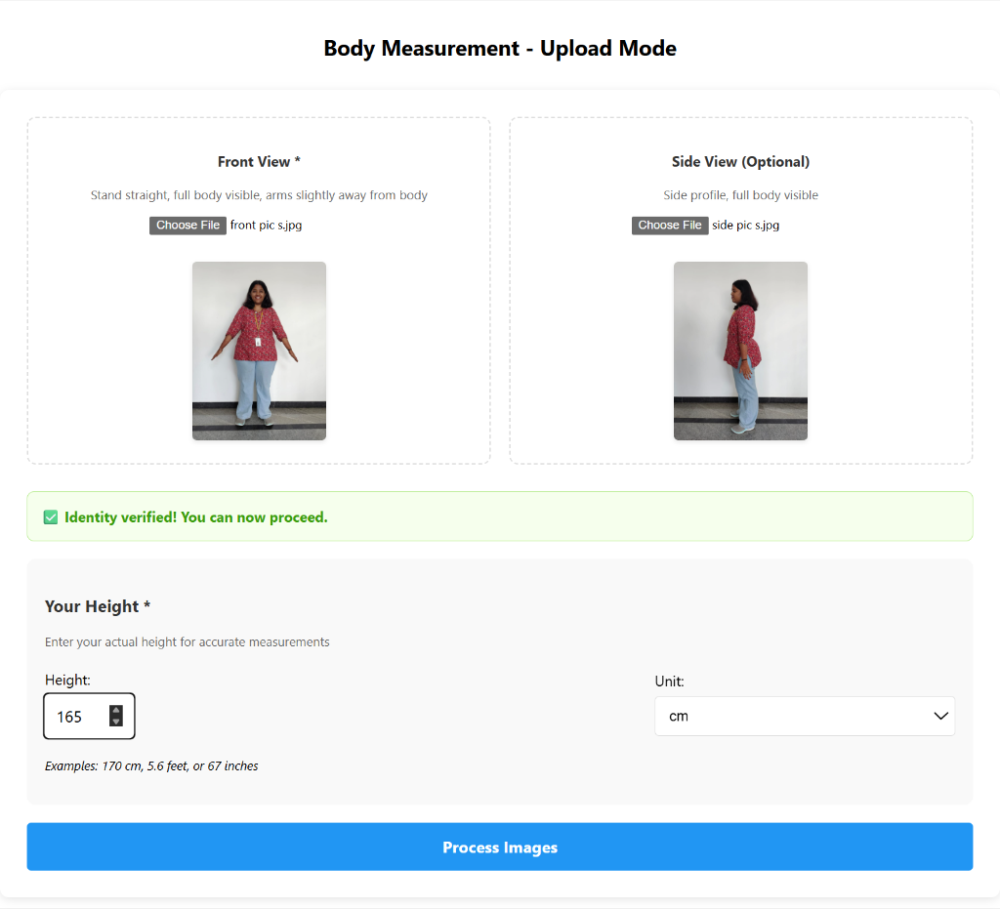
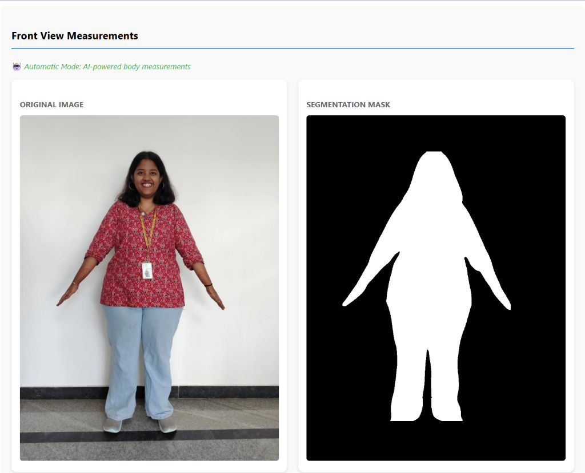
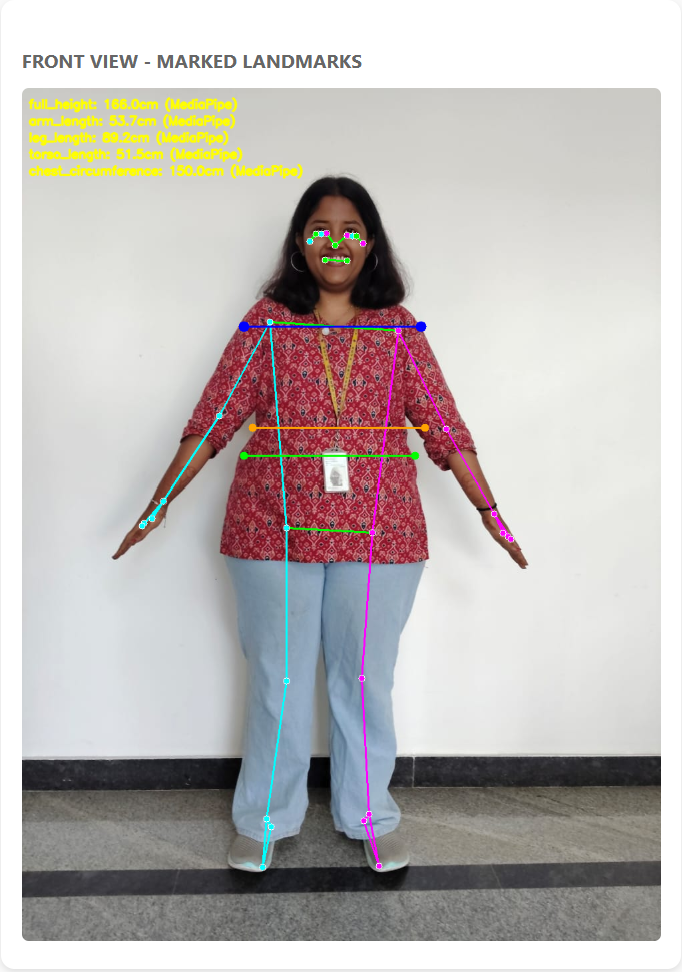
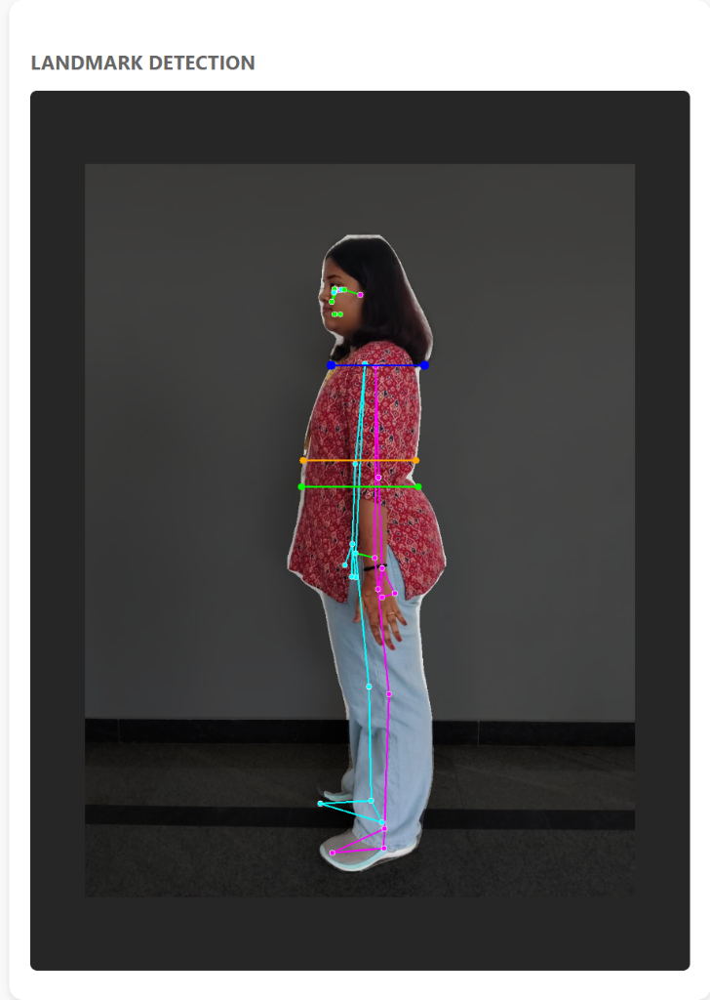
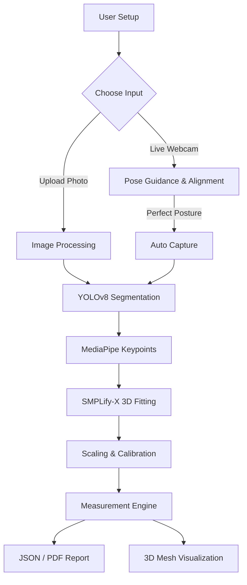

# 🤳 FitLens: AI-Powered Body Measurement System

[](https://github.com/sinchanas4u-a11y/Fit-Lens)
[](https://react.dev/)
[](https://pytorch.org/)
[](https://opencv.org/)

FitLens is a body measurement system that extracts physical dimensions from standard 2D images using computer vision and deep learning. It combines YOLOv8 segmentation, MediaPipe landmark detection, and SMPLify-X 3D body estimation to estimate measurements like height, shoulder width, and circumferences without any specialized hardware — just a phone camera and a wall.

---

## 🎥 Demo

[[🎥 Click here to watch/download the Demo Video](https://img.youtube.com/vi/wRXyd5zMXGU/maxresdefault.jpg)](https://www.youtube.com/watch?v=wRXyd5zMXGU)

---

## 🖼️ Screenshots

### Landing Page — Choose Input Method



### Upload Flow — Front & Side View Capture



### Detection Method Selection



### Landmark Detection — Front View



### Landmark Detection — Side View



---

## 📖 Project Overview

FitLens offers two ways to interact with the system:

- **🚀 Web Dashboard (Recommended):** A React + Vite frontend backed by a Flask API, using YOLOv8 for segmentation and SMPLify-X for 3D reconstruction and circumference estimation.
- **🖥️ Desktop Standalone:** A lightweight real-time tracking mode for posture correction and direct measurement via a live camera feed.

The system provides real-time feedback on posture, distance from camera, and alignment before capturing a photo, so that each image is usable for measurement rather than requiring retakes.

## ✨ Features

- **🎯 Multi-Metric Measurement:** Estimates 15+ body metrics — height, shoulder width, chest/waist/hip circumference, and limb lengths.
- **🧊 3D Body Reconstruction:** Generates a personalized SMPL mesh from 2D images for visualization; circumference is estimated separately via convex-hull approximation.
- **🤖 Real-Time Guidance:** Posture correction prompts ("Stand straight", "Move back", "Straighten arms") during live capture.
- **🖼️ Automatic Segmentation:** Isolates the subject from the background using YOLOv8-seg to reduce background interference.
- **📏 Flexible Calibration:** Supports both reference-object calibration (e.g. A4 paper) and user-height-based scaling.
- **📄 Report Generation:** Produces PDF and Word reports with annotated keypoints and measurement data.
- **🔒 Local-First Processing:** Images are processed in-memory and are not persisted by default.

## ⚠️ Known Limitations

Being upfront about these because they shape how the results should be interpreted:

- **Regression correction is dataset-limited:** The correction coefficients used to adjust raw measurements were tuned on a small, self-collected dataset and haven't been validated against a broader, independent population — accuracy may vary for body types outside that sample.
- **Circumference estimates (chest/waist/hip) are the least validated measurements:** These are approximated using SciPy's ConvexHull on 2D landmark points, not derived from the SMPL 3D mesh — the SMPL fit (via SMPLify-X) is currently used for mesh visualization only and does not feed into circumference calculations. A 2D convex-hull approximation is inherently rougher than a true volumetric estimate, and is more sensitive to lighting, clothing looseness, and pose deviation than direct linear measurements (height, limb length).
- **Single-image-per-view input:** The system relies on one front and one (optional) side photo rather than multiple angles or a scan, which limits robustness to pose or lighting variation.
- **No clinical validation:** Measurements are estimates for fitting/fitness-tracking use cases, not a substitute for professional/medical measurement.
- **Compute-heavy pipeline:** SMPLify-X fitting is slow on CPU; a GPU is recommended for reasonable processing time, which limits easy cloud deployment on free-tier hosting.
- **No authentication layer yet:** (see Authentication section below) — not production-ready as-is.

## 🛠️ Technology Stack

| Layer         | Technology            | Verified Role                                                                                      |
| :------------ | :-------------------- | :------------------------------------------------------------------------------------------------- |
| **Frontend**  | React 18 + Vite       | UI, image upload, results display, silhouette overlay                                              |
| **Frontend**  | Three.js              | Renders SMPLify-X 3D body mesh in browser                                                          |
| **Frontend**  | Axios                 | HTTP requests, frontend → Flask backend                                                            |
| **Frontend**  | Socket.IO client      | Live camera streaming, progress updates, voice guidance                                            |
| **Backend**   | Python 3.10           | Runtime                                                                                            |
| **Backend**   | Flask                 | REST API server                                                                                    |
| **Backend**   | Flask-SocketIO        | Real-time communication for live camera mode                                                       |
| **Vision**    | YOLOv8n-seg           | Body segmentation mask + person bounding box for height reference                                  |
| **Vision**    | MediaPipe Pose        | 33 skeletal landmarks on masked body image                                                         |
| **Vision**    | InsightFace buffalo_l | Face identity validation — photo upload mode only                                                  |
| **Vision**    | Detectron2            | Alternative segmentation — desktop standalone version only                                         |
| **ML**        | PyTorch               | Deep learning runtime                                                                              |
| **3D Body**   | SMPLify-X             | Fits 3D body model to 2D keypoints → mesh visualization only                                       |
| **3D Body**   | SciPy                 | ConvexHull (attempted circumference), optimize.minimize (pose optimization), sparse (SMPL loading) |
| **Core**      | OpenCV                | Image preprocessing, masking, camera capture                                                       |
| **Core**      | NumPy                 | Pixel math, coordinate calculations, scale factor                                                  |
| **Reporting** | ReportLab             | PDF export                                                                                         |
| **Reporting** | python-docx           | Word export                                                                                        |

## 🏗️ Project Architecture



### Folder Structure

```text
FitLens/
├── backend/                  # Flask API & CV logic
│   ├── app.py                 # Main entry point (YOLO pipeline)
│   ├── measurement_engine.py  # Geometric measurement algorithms
│   ├── landmark_detector.py   # MediaPipe & shoulder refinement
│   └── smpl/                  # SMPL model & 3D estimators
├── frontend-vite/             # React + Vite dashboard
│   ├── src/                   # UI components & 3D mesh views
│   └── package.json
├── processing/                # SMPLify-X heavy processing
├── models/                    # Model weights (.pt, .onnx)
├── data/                      # Temporary cache & image inputs
├── main.py                    # Standalone real-time tracking implementation
├── config.py                  # Shared application configuration
└── requirements.txt           # Backend dependencies
```

## 📋 Prerequisites

- **OS:** Windows 10/11, Ubuntu 20.04+, or macOS (Intel/M1)
- **Python:** 3.8–3.11 (Detectron2 has compatibility issues with 3.12)
- **Node.js:** v18 or later (for frontend)
- **Hardware:**
  - Minimum: 8GB RAM, 4-core CPU
  - Recommended: 16GB RAM, NVIDIA GPU (8GB+ VRAM) for SMPLify-X

## 🚀 Installation Guide

### Windows

```bash
git clone https://github.com/sinchanas4u-a11y/Fit-Lens.git
cd Fit-Lens

python -m venv venv
.\venv\Scripts\activate

pip install -r requirements.txt
cd backend
pip install -r requirements.txt

cd ../frontend-vite
npm install
```

### Linux / macOS

```bash
python3 -m venv venv
source venv/bin/activate
pip install -r requirements.txt
cd frontend-vite && npm install
```

## ⚙️ Environment Variables

### Backend (`/backend/.env`)

```env
PORT=5000
DEBUG=True
ALLOWED_ORIGINS=http://localhost:5173
MODEL_CONFIDENCE=0.5
SAVE_OUTPUT=True
```

### Frontend (`/frontend-vite/.env`)

```env
VITE_API_BASE_URL=http://localhost:5000
VITE_SOCKET_URL=http://localhost:5000
```

## 🏃 Running the Application

### Option 1: Full-Stack Web App (Recommended)

**Windows (batch script):**

```bash
RUN_FULLSTACK.bat
```

**Manually:**

```bash
# Terminal 1
cd backend && python app.py

# Terminal 2
cd frontend-vite && npm run dev
```

### Option 2: Standalone Real-Time App

```bash
python main.py
```

## 🔌 API Endpoints

### Health Check

`GET /api/health`

- **Response:** `{ "status": "healthy", "models_loaded": { ... } }`

### Process Images

`POST /api/upload/process`

- **Body (JSON):**
  ```json
  {
    "front_image": "base64...",
    "side_image": "base64...",
    "reference_image": "base64...",
    "user_height": 175.0,
    "gender": "male"
  }
  ```
- **Response:** Detailed measurements, 3D mesh data, and calibration info.

## 🛡️ Authentication and Authorization

The current version runs locally and does not implement a login system, prioritizing speed of use during evaluation. Production deployment would require an OAuth2 or JWT-based auth layer — noted as a planned enhancement, not an oversight.

## 📘 Usage Guide

- **Calibration:** Stand 2–3 meters from the camera. If using a reference object (e.g. A4 paper), ensure it's visible in the dedicated calibration photo.
- **Posture:** Face the camera with arms slightly away from the body (A-pose).
- **Lighting:** Use even lighting; avoid strong backlighting or shadows that obscure body edges.
- **Capture:** In live mode, the system auto-captures once posture is aligned.

## 🛠️ Troubleshooting

- **"Detectron2 not found":** Common on Windows. See `INSTALL_WINDOWS.md` for build instructions, or use the YOLOv8/MediaPipe pipeline, which has no such dependency.
- **CUDA/GPU errors:** Ensure NVIDIA drivers are current. Without a GPU, the system falls back to CPU — SMPLify-X will be noticeably slower.
- **Socket connection failed:** Confirm the backend is running and CORS is configured correctly in `.env`.

## 🔮 Future Enhancements

- Mobile AR integration (iOS/Android)
- Automated clothing/size recommendation engine
- Multi-user profiles and measurement history
- Cloud sync with fitness apps (Apple Health, Google Fit)
- Broader dataset validation for regression correction and circumference accuracy

## 🤝 Contributing

Contributions are welcome:

1.  Fork the project
2.  Create a feature branch (`git checkout -b feature/AmazingFeature`)
3.  Commit your changes (`git commit -m 'Add some AmazingFeature'`)
4.  Push to the branch (`git push origin feature/AmazingFeature`)
5.  Open a Pull Request

## 👥 Authors

- **Sinchana S** — B.Tech Information Science & Engineering, REVA University
- **Team Members:** Rishith M, Spandana M, Spoothi D
- **Faculty Guide:** Dr. Argha Sarkar

## 🙏 Acknowledgments

- Ultralytics YOLOv8
- MediaPipe by Google
- SMPLify-X
- Detectron2
